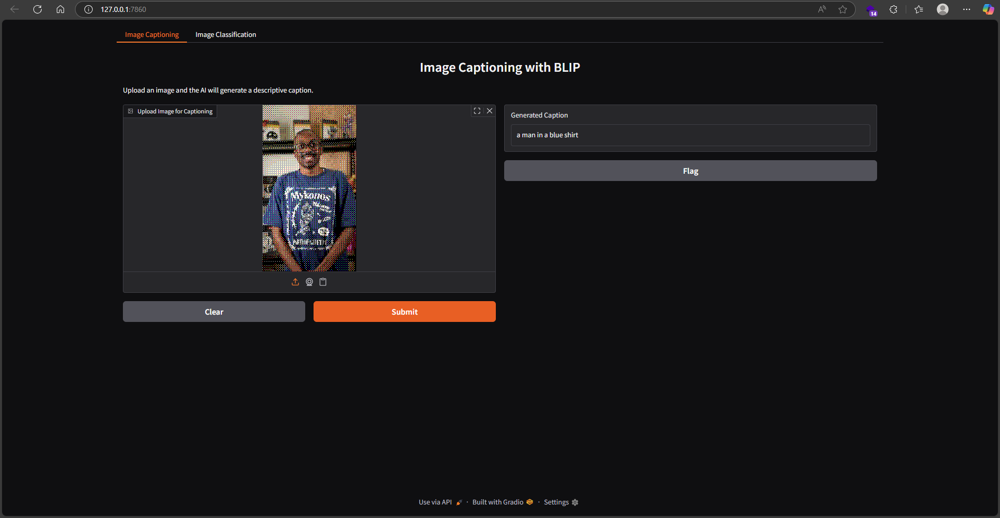
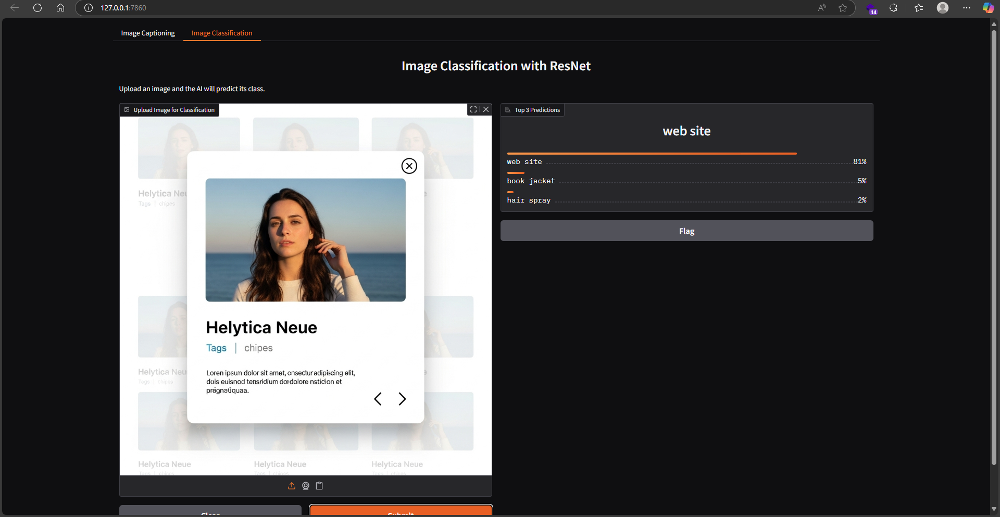

# AI Vision Toolkit: Image Captioning & Classification

[](https://www.python.org/)
[](https://www.gradio.app/)
[](https://huggingface.co/docs/transformers/index)
[](https://pytorch.org/)
[](https://opensource.org/licenses/MIT)

This repository contains a comprehensive AI toolkit built as the capstone project for the "Building Generative AI-Powered Applications with Python" course by IBM on Coursera. It showcases the end-to-end development of a multi-functional AI application, from initial scripting in notebooks to a deployable, command-line accessible tool.

## Core Features

1.  **Interactive Web App (`app.py`):** A user-friendly Gradio web interface with two distinct modes for real-time interaction:
    *   **Image Captioning:** Generates descriptive captions for uploaded images using the Salesforce BLIP model.
    *   **Image Classification:** Identifies objects in uploaded images using a ResNet model, providing the top 3 predictions.

2.  **Powerful Command-Line Tool (`captioner_cli.py`):** An automated script for batch processing with two modes of operation:
    *   **URL Mode:** Scrapes a given webpage, extracts all valid images, and generates captions.
    *   **Local Mode:** Processes an entire local folder of images at once.

3.  **Deployment Ready:** Includes a `Dockerfile` for easy containerization, allowing the application to be deployed to any cloud environment.

## Demo & Screenshots

*The interactive web application built with Gradio, showcasing its dual functionality.*




## Tech Stack

*   **Python** with `argparse` for CLI implementation
*   **Gradio** for the interactive web UI
*   **Hugging Face `transformers`** for model loading and inference
*   **PyTorch** as the deep learning backend
*   **BeautifulSoup4** for HTML parsing and web scraping
*   **Docker** for containerization

---

## Setup and Running the Toolkit

**1. Clone the Repository**
```bash
git clone https://github.com/cozisoul/Captioning-Photos-with-Generative-AI.git
cd Captioning-Photos-with-Generative-AI
```

**2. Create and Activate a Virtual Environment**
```bash
# Create the environment
python -m venv .venv
# Activate (example for Git Bash on Windows)
source .venv/Scripts/activate
```

**3. Install Dependencies**
```bash
pip install -r requirements.txt
```

---

## Running the Tools

**A. To Launch the Interactive Web App:**
```bash
python app.py
```
*Navigate to the local URL in your browser (e.g., `http://127.0.0.1:7860`).*

**B. To Use the Command-Line Tool:**

*   **Caption images from a local folder:**
    1.  Place images in the `images` directory.
    2.  Run the command:
        ```bash
        python captioner_cli.py --local_dir images
        ```
        *(Output is saved to `local_captions.txt`)*

*   **Caption images from a URL:**
    ```bash
    python captioner_cli.py --url https://en.wikipedia.org/wiki/Cat
    ```
    *(Output is saved to `url_captions.txt`)*

---

## Developer's Log: Challenges & Key Learnings

This project was a deep dive into the full lifecycle of an AI application. The journey from simple scripts to a polished toolkit involved overcoming several real-world challenges, which were invaluable learning experiences.

### Key Challenges

*   **Environment Management:** Encountered and resolved `ModuleNotFoundError` by strictly adhering to virtual environment best practices, ensuring all dependencies were installed in the isolated `.venv` and not globally.

*   **Operating System Constraints:** Solved a critical `OSError` during installation caused by the "Windows Long Path" limitation. Lacking admin rights, the solution was to restructure the project into a shorter file path, a practical lesson in environment portability.

*   **Dependency Nuances:** Debugged installation failures by learning the specific package names required (e.g., `beautifulsoup4` instead of `beautifulsoup`) and understanding that core libraries like `torch` don't automatically include extensions like `torchvision`.

### Core Competencies Gained

*   **Model Integration:** Gained hands-on experience using the Hugging Face `transformers` library to run powerful, pre-trained vision models like BLIP and ResNet.

*   **Application Development:** Learned to use Gradio to rapidly build and launch a clean, multi-tab web interface, moving beyond simple scripts to user-facing applications.

*   **DevOps & Best Practices:** This project was a practical lesson in essential developer operations:
    *   **Version Control:** Using `git` and GitHub to meticulously track changes, manage features, and build a project portfolio.
    *   **Reproducibility:** Creating and managing a `requirements.txt` file and a `Dockerfile` to ensure the project is easily reproducible and deployable by others.
    *   **Systematic Problem-Solving:** Honed debugging skills by reading tracebacks carefully to identify the root cause (environment vs. code vs. OS) and applying targeted solutions.

## Future Improvements

*   **Async Processing:** Convert the web scraping logic to be asynchronous to process images from a URL much faster.
*   **Model Selection UI:** Allow the user to select different captioning models (e.g., BLIP vs. BLIP-2) from a dropdown in the Gradio app.
*   **Cloud Deployment:** Deploy the containerized application to a cloud service like Hugging Face Spaces or AWS for a public, live URL.

## License

This project is licensed under the MIT License. See the [LICENSE](LICENSE) file for details.

## Acknowledgments

*   This project was completed as part of the **Building Generative AI-Powered Applications with Python** course offered by **IBM** on the **Coursera** platform.